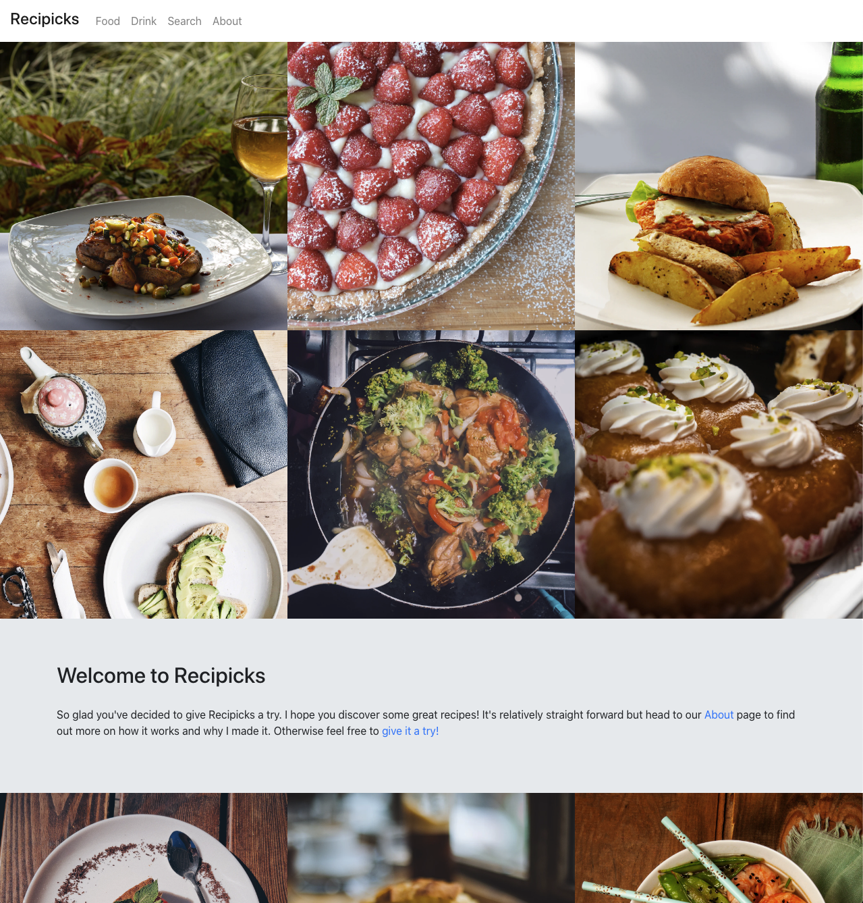
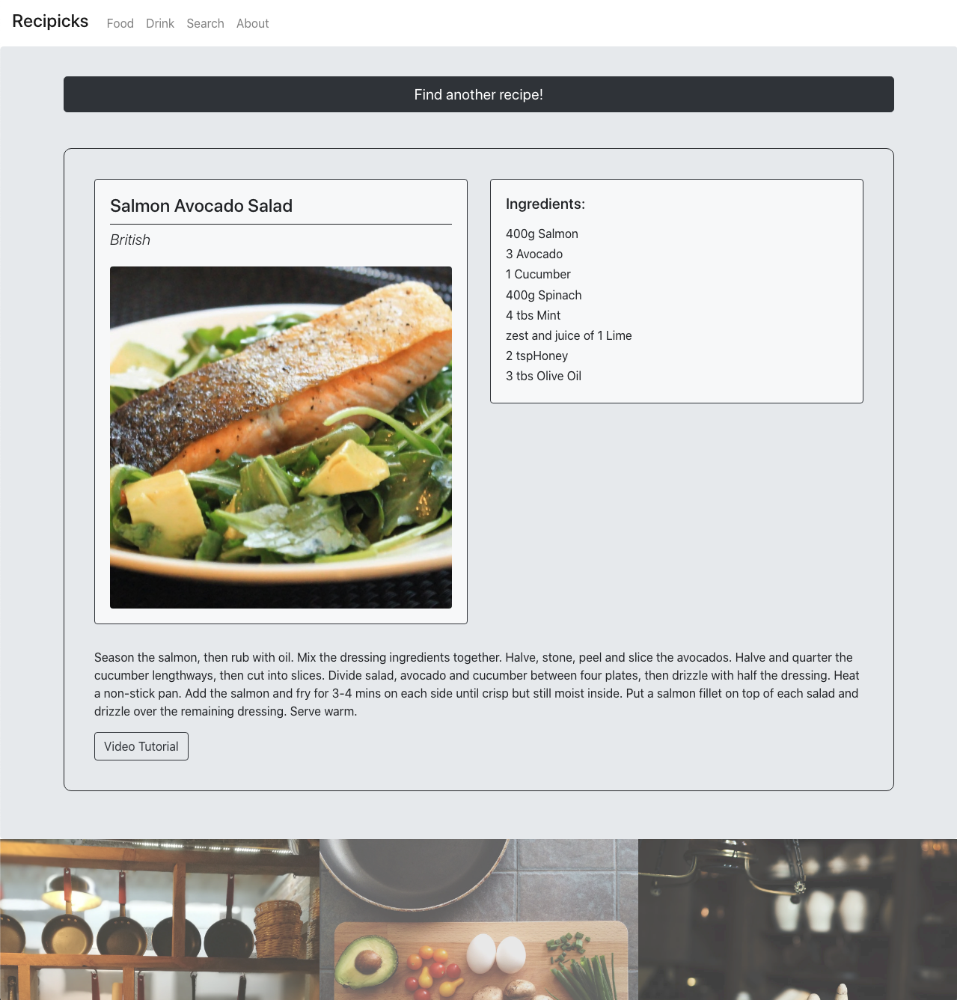
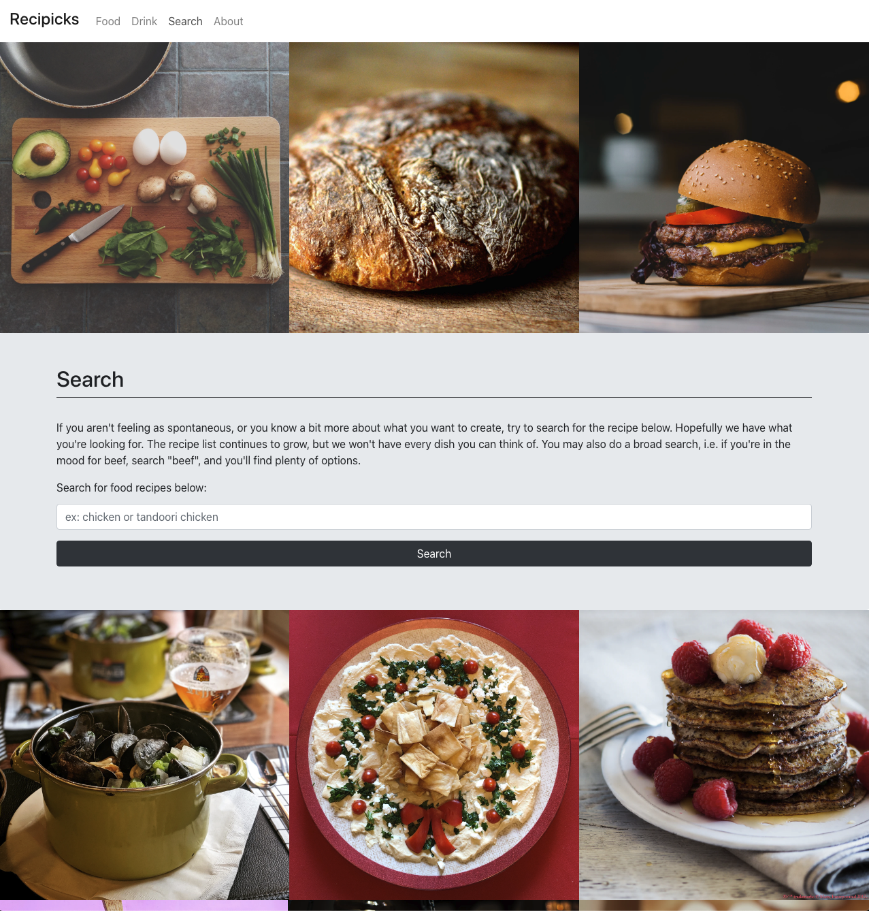

# Recipicks

## Description

I love cooking at home. I love exploring new dishes and trying recipes that challenge me. During bootcamp that's been a bit stifled, naturally. So I'm very excited to integrate cooking new recipes into this SPA! Some days I know I want to cook but don't feel inspired by my cookbooks or I feel indecisive about what Im googling for. So with Recipicks, a user can simply click through a randomized repertoire of recipes until they land on one that excites! Once the user selects a recipe they'll have all the information they need to replicate it. Enjoy!

---

---

---

---

## Technologies Used

API(s)
- The Meal DB
- The Cocktail DB
- Link: https://www.themealdb.com/
- Link: https://www.thecocktaildb.com/

Frameworks, Sources etc.
- React
- Bootstrap
- Unsplash for style images
- Favicon generator for favicon
- Found how to use React Player on Coder Rocket Fuel and React Player github repo

---

## Install Instructions
- Use application by heading to the url depolyed on heroku and clicking on food or drink tab and click the 'find more' button for more recipes, or head to the search tab to search for food recipes by keyword
- OR fork and clone this repo
---

## Contribution Guidelines

- Fork and clone this repo. Create pull request to add to the app. Thank you!
---
